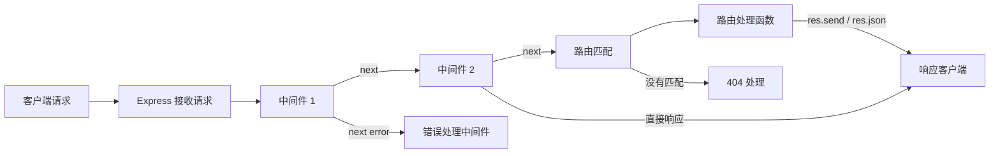

```mermaid
flowchart LR
    A[客户端请求] --> B[Express 接收请求]
    B --> C[中间件 1]
    C -->|next| D[中间件 2]
    D -->|next| E[路由匹配]
    E --> F[路由处理函数]
    F -->|res.send / res.json| G[响应客户端]
    C -->|next error| H[错误处理中间件]
    D -->|直接响应| G
    E -->|没有匹配| I[404 处理]
```
