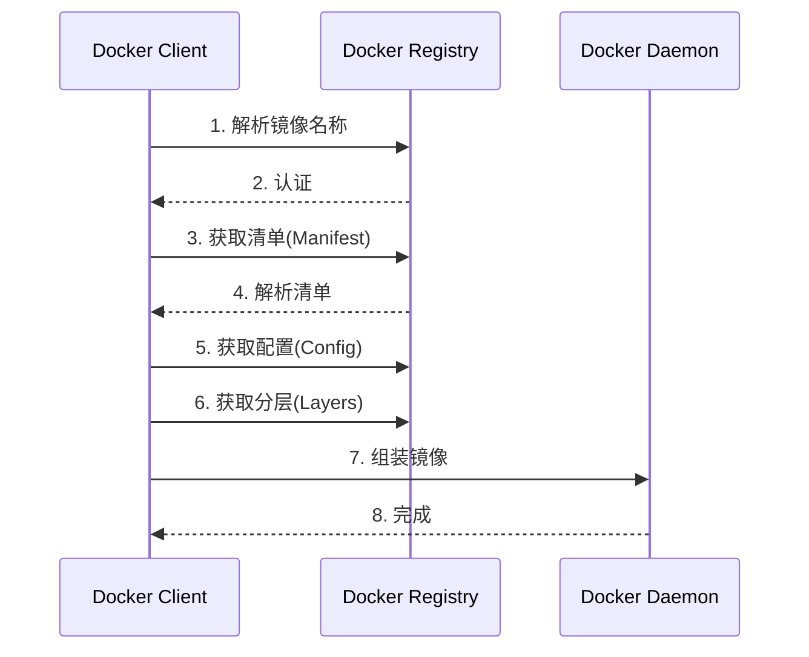
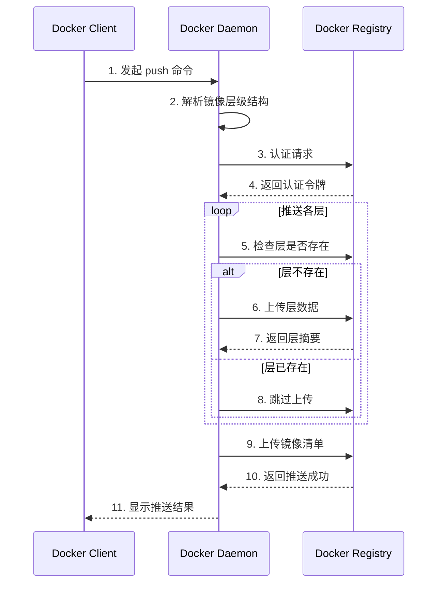
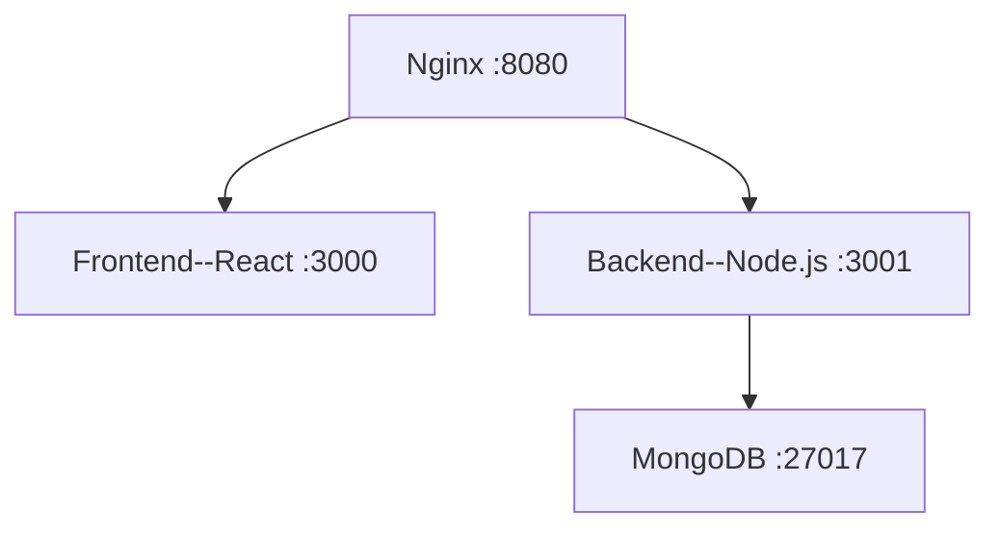

# Docker 基础
## 查看 Docker 信息

```shell
docker version  # 查看版本信息
docker info     # 查看运行时信息
```
## 运行第一个容器：hello-world

```shell
docker run hello-world
```

> 学习一门新语言，第一个程序是输出 hello world！  
> 学习 Docker，第一个容器运行输出 hello from Docker！
## 案例：运行 Alpine Linux 容器

> **扩展知识**：  

> Alpine 镜像在企业生产环境中被广泛应用：

> - 极简的 Linux 发行版

> - 只包含基本命令和工具

> - 镜像体积小（约 8MB）

> - 内置包管理系统 `apk`

> - 常用作其他镜像的基础
### 镜像操作

#### 1. 拉取镜像

```shell
# 拉取 alpine 镜像，默认以 latest 标签拉取
docker pull alpine
```
#### 2. 查看镜像

```shell
docker image ls
```

镜像格式：`[REGISTRY_HOST[:PORT]/]REPOSITORY[:TAG]`
- REGISTRY_HOST：镜像仓库地址，默认 Docker Hub
- REPOSITORY：镜像仓库名称
- TAG：镜像标签，默认 latest
完整镜像示例：
```shell
docker.cnb.cool/docker-666/campus-academy-template/dev-env:latest
```
- REGISTRY_HOST：docker.cnb.cool
- REPOSITORY：docker-666/campus-academy-template/dev-env
- TAG：latest
eg:
```

# docker image ls
REPOSITORY                                                   TAG       IMAGE ID       CREATED       SIZE
docker.cnb.cool/docker-666/campus-academy-template/dev-env   latest    890755180ee4   7 hours ago   722MB
mongo                                                        6         bdc4e039b30b   8 weeks ago   764MB
```
#### 3. 镜像可见性
镜像分为两种类型：
- **Public**：无需登录即可拉取
- **Private**：需要登录后才能拉取
```shell
# 公开镜像（正常拉取）
docker pull docker.cnb.cool/coldenn/docker-open-camp/docker-exercises/my-alpine:latest
# 私有镜像（拉取失败）
docker pull docker.cnb.cool/docker-open-camp/private-repo/my-alpine
```
#### 4. 登录镜像仓库

```shell
docker login [-u ${username}] [-p ${password}] ${repository}
```
#### 5. 删除镜像

```shell
docker image rm ${image_id}
```
#### 6. 查看镜像历史
```shell
docker history ${image_id}
```
### 容器操作
#### 1. 运行容器
```shell
docker run alpine
```
#### 2. 查看容器

```shell
docker ps
```
> **问题**：为什么看不到刚启动的容器？  
> **原因**：容器没有前台进程会立即退出
查看所有容器（包括已停止的）：

```shell
docker ps -a
```
#### 3. 交互式运行容器

```shell
docker run -it alpine  # 等效于 docker run -it alpine /bin/sh
# 查看镜像默认命令 docker inspect alpine | grep -A 5 "Cmd"
```
参数说明：
- `-it`：分配交互式终端（interactive + TTY）
- `-d`：后台运行容器（detached mode）
`run -it` 命令会启动一个交互式终端，退出终端后容器也会停止，如果希望容器在后台运行，可以使用 -d 参数
#### 4. 后台运行容器
```shell
docker run -d alpin
```
#### 5. 进入运行中的容器

```shell
docker exec -it <container_id> /bin/sh
```
进程查看示例：
```text
/ # ps -ef
PID   USER     TIME  COMMAND
    1 root      0:00 /bin/sh
   13 root      0:00 /bin/sh
   19 root      0:00 ps -ef
```

PID=1 的进程为 /bin/sh， 而另一个 /bin/sh 进程则是我们通过 exec 命令启动的，这个进程退出不会影响 PID=1 的进程，也就不会导致容器的退出
#### 6. 替代进入方式（不推荐）

```shell
docker attach <container_id>
```
> **注意**：  
> attach 会接管 PID=1 的进程，如果该进程退出，容器也会退出
#### 7. 查看容器详情

```shell
docker inspect alpine
```
##### 8. 查看容器日志
```shell
docker logs <container_id>
```
## 拓展

### OCI镜像规范

OCI 定义的镜像包括4个部分：镜像索引（Image Index）、清单（Manifest）、配置（Configuration）和层文件（Layers）。镜像索引是镜像中可选择的部分，一个镜像可以不包括镜像索引。如果镜像包含了镜像索引，则其作用主要指向镜像不同平台的版本，代表一组同名且相关的镜像，差别只在支持的体系架构上。

### Docker 镜像存储


### Docker pull 和 Docker push 发生了什么

  

#### Docker pull



#### Docker push



### 镜像分层 OverlayFS


1. OverlayFS 的核心概念
OverlayFS 是一种 联合文件系统（Union Filesystem），它通过 堆叠多层目录 实现文件系统的叠加，主要分为：
• Lower Dir（镜像层）：只读的基础层（可以是多个，对应 Docker 镜像的每一层）。
• Upper Dir（容器层）：可写层，容器运行时新增或修改的文件会存储在这里。
• Merged Dir（合并视图）：用户看到的最终统一文件系统，是上下层叠加后的结果同名文件覆盖 访问文件时，优先从 upperdir 读取

2. OverlayFS 的工作示例
假设镜像层（lowerdir）有一个文件 /galaxy，而容器层（upperdir）也创建了同名文件：

```

# 镜像层（只读）
lowerdir/

    └── galaxy    # 内容："Hello from image"

# 容器层（可写）
upperdir/

    └── galaxy    # 内容："Hello from container"

# 用户看到的合并视图
merged/

    └── galaxy    # 实际显示 "Hello from container"（上层覆盖下层）

```

当删除容器层的 galaxy 文件时：
容器层会创建 whiteout 文件
```
upperdir/
    └── galaxy # 特殊字符文件表示删除

合并视图
mergeddir/
    └── galaxy # 文件消失（实际被隐藏）

```

3. Docker 如何使用 OverlayFS
• 镜像层：Docker 镜像的每一层（如 FROM alpine, RUN apk add）都是 lowerdir。
• 容器层：启动容器时创建的 upperdir 是可写层，存储所有运行时修改。
• 性能优化：OverlayFS 通过 写时复制（Copy-on-Write） 避免直接修改镜像层，提升效率。
![[局部截取_20251130_093446.png]]
4. 验证 Docker 的存储驱动
运行以下命令查看 Docker 是否使用 OverlayFS：
```
docker info | grep "Storage Driver"
```
输出示例：
```
Storage Driver: overlay2
```
### Namespace 和 cgroups
Namespace 和 cgroups 是 Linux 内核提供的两种资源隔离技术，用于实现容器的资源隔离和限制。
- Namespace 用于隔离进程的系统资源，包括进程树、网络、用户、主机名、挂载点、进程 ID 等。
- cgroups 用于限制进程的资源使用，包括 CPU、内存、磁盘 I/O、网络带宽等。
![[Pasted image 20251130093527.png]]
---
# 自定义镜像之 Dockerfile 详解

如想定制一个个性化的环境，安装一些特定的软件，这个时候就需要我们自定义镜像。
## 命令式创建镜像（从容器创建镜像）
### 案例
创建一个自定义镜像，基于alpine镜像，并安装figlet工具。
（figlet：输出艺术字符串的小工具）
#### 1. 启动一个基础容器
``` shell
docker run -it --name alpine alpine
```
#### 2. 向容器中安装 figlet 工具
然后我们进入容器，在容器中执行一些命令（安装一个软件），然后退出容器。
```shell
docker exec -it alpine /bin/sh
apk update
apk add figlet
exit
```
这样，我们就在 alpine 容器中安装了 figlet 工具。
#### 3. 保存容器为镜像
然后我们需要将这个新的容器环境跟其他人分享，我们可以通过 commit 命令将容器保存为一个镜像。
```shell
docker ps -a #查看容器
docker commit ${container_id} alpine-figlet
```
这样，我们就创建了一个名为alpine-figlet的镜像
#### 4. 使用新镜像
最后我们就可以使用这个新的镜像了, 运行体验下艺术字生成的效果。
```shell
docker run alpine-figlet figlet "hello docker"
```
#### 5. 推送镜像
最后我们也可以使用 `docker push` 命令将镜像推送到镜像仓库中，其他人便可以使用 `docker pull` 来使用这个镜像了。

上述从容器创建镜像的方式虽然简单易懂，但是考虑真实项目中，我们可能需要安装很多工具，比如 git，vim，curl，wget 等等。如果我们每次都使用这种方式来创建镜像，就会非常麻烦，并且容易出错。
### 命令式创建的局限性
1. **不可重复性**：容器安装过程依赖人工操作，无法保证环境一致性
2. **臃肿镜像**：容器可能包含临时文件/缓存，导致镜像体积膨胀
3. **安全风险**：无法追溯安装过程，可能存在安全隐患
4. **维护困难**：无法版本化管理构建步骤
因此，我们需要一种更加方便的镜像创建方式，这就是 Dockerfile。
## 声明式创建镜像（Dockerfile）
我们来使用 [Dockerfile](./Dockerfile) 来自定义一个同样的镜像。它的格式是：
``` shell
docker build -t alpine-figlet-from-dockerfile .
docker run alpine-figlet-from-dockerfile figlet "hello docker"
```
这样当我们需要安装 git 的时候，只需要修改 Dockerfile 中的命令后重新构建镜像即可。

```shell
docker build -t alpine-figlet-from-dockerfile .
docker run alpine-figlet-from-dockerfile git
```
## 小结
关于Dockerfile，上节课我们介绍部署技术历史中提及过，它的出现，帮助 Docker 成为容器化时代下最受欢迎的方案
### 那它到底是什么呢？

Dockerfile是一种静态文件，用来声明镜像的内容。

### Dockerfile 为什么如此重要呢？

Dockerfile给容器化实践提供了一种规范，让创建镜像的操作简单化，标准化。

简单化让开发者可以快速上手，标准化让镜像可以重复使用，可移植，可复用。这些好处从侧面上推动了 Docker 的普及。
# Dockerfile实践&关键语法介绍

## 使用 Dockerfile 构建一个 jupyter notebook 镜像

让我们使用 Docker 来构建一个真实可用的镜像，比如 jupyter notebook 镜像。[Dockerfile](./jupyter_sample/Dockerfile)
```shell
docker build -t jupyter-sample jupyter_sample/
```
该镜像使用 RUN 指令来安装 jupyter notebook，使用 WORKDIR 指令设置工作目录，
使用 COPY 指令将代码复制到镜像中，使用 EXPOSE 指令来暴露端口，
最后使用 CMD 指令来启动 jupyter notebook 服务。
使用上述镜像来启动 jupyter notebook 服务。

```shell
docker run -d -p 8888:8888  jupyter-sample
```

我们使用了 -p 参数来将容器内的 8888 端口映射到宿主机的 8888 端口，在 cnb 上我们可以通过添加一个端口映射来实现外网访问。

## 使用多阶段构建来打包一个 golang 应用

  
在实际开发中，我们经常需要构建 golang 应用。
如果使用传统的单阶段构建，最终的镜像会包含整个 Go 开发环境，导致镜像体积非常大。
通过多阶段构建，我们可以创建一个非常小的生产镜像。

创建一个 [main.go](./golang_sample/main.go) 文件，
一个普通构建的 [Dockerfile](./golang_sample/Dockerfile.single)
以及一个多阶段构建的 [Dockerfile](./golang_sample/Dockerfile.multi)
构建镜像：
```shell
docker build -t golang-demo-single -f golang_sample/Dockerfile.single golang_sample/

docker build -t golang-demo-multi -f golang_sample/Dockerfile.multi golang_sample/
```
运行容器：
```shell
docker run -d -p 8080:8080 golang-demo-single

docker run -d -p 8081:8081 golang-demo-multi
```
容器运行成功后可以通过如下命令行来访问，可以看到两个容器都是在运行我们写的 golang 服务。
```shell
curl http://localhost:8080

curl http://localhost:8081
```

让我们来对比一下单阶段构建和多阶段构建的区别：

```shell
# 查看镜像大小
docker images | grep golang-demo
```
你会发现最终的镜像只有几十 MB，而如果使用单阶段构建（直接使用 golang 镜像），镜像大小会超过 1GB。这就是多阶段构建的优势：

- 最终镜像只包含运行时必需的文件
- 不包含源代码和构建工具，提高了安全性
- 大大减小了镜像体积，节省存储空间和网络带宽

这种构建方式特别适合 Go 应用，因为 Go 可以编译成单一的静态二进制文件。在实际开发中，我们可以使用这种方式来构建和部署高效的容器化 Go 应用。
## Dockerfile 命令

![[Pasted image 20251130094107.png]]
### 构建过程

- 每个保留关键字（指令）都必须是大写字母
- 从上到下顺序执行
- "#" 表示注释
- 每一个指令都会创建提交一个新的镜像层并提交
### CMD 和 ENTRYPOINT 的区别

- CMD             # 指定这个容器启动的时候要运行的命令，只有最后一个会生效可被替代
- ENTRYPOINT      # 指定这个容器启动的时候要运行的命令， 可以追加命令

### Dockerfile 优化技巧

- **层合并**：合并 RUN 指令减少镜像层数
    ```dockerfile
    RUN apk update && \
        apk add --no-cache figlet git && \
        rm -rf /var/cache/apk/*
    ```

- **多阶段构建**：构建多个镜像层，最后只保留最终的镜像层
- 使用 .dockerignore 文件来忽略不需要的文件
- 避免硬编码敏感信息，而是使用环境变量

    ```
    ARG DB_PASSWORD
    ENV DB_PASSWORD=${DB_PASSWORD}
    ```

- 使用特定版本的基础镜像，避免因基础镜像更新导致的不稳定性

    ```Dockerfile
    FROM alpine:3.14  # 明确指定版本
    ```

# Docker 存储管理详解

Docker 容器在运行时会产生大量数据，这些数据如何持久化和管理是一个重要的话题。
我们通过一个 Nginx Web 服务器的案例，来深入探讨 Docker 的三种数据管理方式。

## Docker 存储基础

Docker 提供了三种主要的数据管理方式：

1. **默认存储**：容器内的数据随容器删除而丢失

2. **Bind Mounts（绑定挂载）**：将主机上的目录或文件直接挂载到容器中

3. **Volumes（卷）**：由 Docker 管理的持久化存储空间，完全独立于容器的生命周期

让我们通过一个 Nginx Web 服务器的例子来理解这三种方式的区别。我们将在每种方式下执行相同的操作：创建一个 HTML 文件，然后测试数据的持久性。

### 场景一：默认存储（非持久化）

在这个场景中，我们直接在容器内创建文件，看看数据会发生什么：

```shell
# 运行一个 nginx 容器
docker run -d --name web-default -p 8000:80 nginx

# 在容器中创建一个测试页面
docker exec -it web-default /bin/sh

echo "<h1>Hello from Default Storage</h1>" > /usr/share/nginx/html/index.html

exit

# 访问页面验证内容
curl http://localhost:8000

# 容器中文件目录获取

# 背景介绍：

#  容器目录是在宿主机目录下的一个子目录，通过chroot的linux技术实现；

#  容器的目录对宿主机隔离，一般禁止访问；

# 该命令用于获取 Docker 容器在宿主机上的实际存储路径。当容器使用联合文件系统（如 overlay2）时，容器文件系统由多个层组成， MergedDir 就是这些层最终合并后在宿主机上的实际目录路径

docker inspect -f '{{.GraphDriver.Data.MergedDir}}' <container_id>

cat 容器目录/usr/share/nginx/html/index.html

# 删除容器
docker stop web-default

docker rm web-default

  
# 用同样的配置重新运行容器
docker run -d --name web-default-2 -p 8000:80 nginx

  

# 再次访问页面，内容不存在
curl http://localhost:8000
```
### 场景二：使用 Bind Mount

在这个场景中，我们将主机上的目录直接挂载到容器中：

```shell
# 创建本地目录
mkdir nginx-content

  

# 运行 Nginx 容器并挂载本地目录
docker run -d --name web-bind \

   -p 8081:80 \

   -v $(pwd)/nginx-content:/usr/share/nginx/html nginx

# 在容器中创建一个测试页面
docker exec -it web-bind sh -c 'echo "<h1>Hello from Bind Mounts</h1>" > /usr/share/nginx/html/index.html'

  

# 访问页面验证内容
curl http://localhost:8081

  

# 删除容器
docker rm -f web-bind

  

# 用同样的配置重新运行容器
docker run -d --name web-bind-2 -p 8081:80 \

   -v $(pwd)/nginx-content:/usr/share/nginx/html nginx

  

# 再次访问页面，内容仍然存在
curl http://localhost:8081
```
### 场景三：使用 Volume
在这个场景中，我们使用 Docker 管理的卷来存储数据：

```shell

# 创建一个 Docker volume
docker volume create nginx_data

  
# 运行 Nginx 容器并挂载卷
docker run -d --name web-volume -p 8082:80 -v nginx_data:/usr/share/nginx/html nginx

  

# 在容器中创建一个测试页面
docker exec -it web-volume sh -c 'echo "<h1>Hello from Volume Storage</h1>" > /usr/share/nginx/html/index.html'

  

# 访问页面验证内容
curl http://localhost:8082

  

# 删除容器
docker rm -f web-volume

  

# 用同样的配置重新运行容器
docker run -d --name web-volume-2 -p 8082:80 \

   -v nginx_data:/usr/share/nginx/html nginx

  

# 再次访问页面，内容仍然存在
curl http://localhost:8082

  

# 查看卷的详细信息
docker volume ls
docker volume inspect nginx_data
```

### 三种方式的对比

  
1. **默认存储**

   - 数据随容器删除而丢失
   - 适合存储临时数据
   - 容器间数据隔离
   - 无需额外配置

  

2. **Bind Mount**

   - 数据持久化，存储在主机指定位置
   - 可以直接在主机上修改文件
   - 不足：目录权限不对等，有安全风险
   - 不足：依赖主机文件系统结构

  

3. **Volume**

   - 数据持久化，独立于容器生命周期
   - 数据存储在 Docker 管理区域，安全性好

### 清理操作
完成实验后，可以进行清理：

```shell
# 清理容器
docker rm -f web-default web-volume web-volume-2 web-bind web-bind-2

# 清理卷
docker volume rm nginx_data

# 清理本地目录
rm -rf nginx-content
```


## 实践案例：使用 Bind Mount 运行 DeepSeek-R1

https://cnb.cool/ai-models/deepseek-ai/DeepSeek-R1-0528-Qwen3-8B-run-with-ollama

## 实践案例：使用 Volume 部署 MySQL 数据库

我们将通过一个 MySQL 数据库的例子来演示如何使用 Volume 持久化数据。

### 创建并管理 Volume

```shell
# 创建一个数据卷，名称为 mysql_data
docker volume create mysql_data

# 列出所有卷
docker volume ls

# 查看卷信息
docker volume inspect mysql_data
```

### 运行 MySQL 容器,并挂载卷

```shell
# 运行 MySQL 容器并挂载卷
# 备注：MYSQL_ROOT_PASSWORD 是环境变量，用于设置 MySQL 的 root 用户密码
docker run -d \

  --name mysql_db \

  -e MYSQL_ROOT_PASSWORD=mysecret \

  -v mysql_data:/var/lib/mysql \

  mysql:8.0

# 进入容器创建测试数据
docker exec -it mysql_db mysql -uroot -pmysecret -h127.0.0.1

# 在 MySQL 中创建测试数据
mysql> CREATE DATABASE test_db;
mysql> USE test_db;
mysql> CREATE TABLE users (id INT, name VARCHAR(50));
mysql> INSERT INTO users VALUES (1, 'John Doe');
mysql> exit
```

### 验证数据持久化

```shell
# 删除原容器
docker rm -f mysql_db

# 使用同一个卷启动新容器
docker run -d \

  --name mysql_db2 \

  -e MYSQL_ROOT_PASSWORD=mysecret \

  -v mysql_data:/var/lib/mysql \

  mysql:8.0

# 验证数据是否存在
docker exec -it mysql_db2 \

   mysql -uroot -pmysecret -e "USE test_db; SELECT * FROM users;"
```
# Docker 网络管理详解

Docker 网络是容器通信的基础设施，它使容器能够安全地进行互联互通。在 Docker 中，每个容器都可以被分配到一个或多个网络中，容器可以通过网络进行通信，就像物理机或虚拟机在网络中通信一样。

## Docker 网络命令详解
在开始学习不同类型的网络之前，我们先来了解一下 Docker 的常用网络命令

```shell
# 列出所有网络
docker network ls

# 创建自定义网络
docker network create [options] <network-name>

# 检查网络详情
docker network inspect <network-name>

# 将容器连接到网络
docker network connect <network-name> <container-name>

# 断开容器与网络的连接
docker network disconnect <network-name> <container-name>

# 删除网络
docker network rm <network-name>

# 删除所有未使用的网络
docker network prune
```

## 网络类型及实践案例

### 容器默认网络

新创建一个容器时，他会默认连接到一个叫“默认Bridge”的网络。而所有链接该网络的容器可以通过这座“桥梁”通信。

Q：这个“默认Bridge网络”是什么？是谁创建的？它的通信原理是？

A：它是由Docker自动创建的，它是一个名为“docker0”的Linux网桥(使用`ip addr`命令可以看到)，功能上就像是一个虚拟的交换机，将容器相互连接，容器之间可以通过这个网桥进行通信。

   连接到它的每个容器都会被分配一个IP地址，相互之间可以通过IP地址进行通信。
   ![[Pasted image 20251130094619.png]]

Q：除了Bridge网络，还有哪些网络类型？

A：除了Bridge网络，Docker还支持Host网络、None网络和自定义网络。Host网络直接将容器连接到主机网络，None网络禁用了容器的网络功能，自定义网络则允许用户创建自己的网络。这些网络类型各有优缺点，可以根据实际需求选择使用。接下来，我们将分别介绍这些网络类型及其实践案例。

### 1. Bridge 网络

#### 实践案例一：默认 Bridge 网络


让我们先来看看默认 bridge 网络的行为：

```shell
# 启动两个nginx容器
docker run -d --name container1 nginx

docker run -d --name container2 nginx

# 查看默认bridge网络的ID
docker network ls

docker network inspect bridge -f '{{.ID}}'

# 查看容器是否连接到默认bridge网络
docker network inspect bridge -f '{{.Containers}}'

docker inspect container1 -f '{{range .NetworkSettings.Networks}}{{.NetworkID}}{{end}}'

docker inspect container2 -f '{{range .NetworkSettings.Networks}}{{.NetworkID}}{{end}}'

# 查看容器的IP地址
docker inspect container1 -f '{{range .NetworkSettings.Networks}}{{.IPAddress}}{{end}}'

docker inspect container2 -f '{{range .NetworkSettings.Networks}}{{.IPAddress}}{{end}}'


# 进入容器1，尝试通过 IP 访问容器2
docker exec -it container1 curl http://172.17.0.3

# 注意：在默认 bridge 网络中，无法通过容器名称访问
docker exec -it container1 curl http://container2  # 这将失败

# 精简镜像可能没有 ip/ifconfig：可以临时安装

# Debian/Ubuntu：apt-get update && apt-get install -y iproute2

```

在默认bridge网络下，容器之间只能通过 IP 地址互相访问，不支持通过容器名称来通信。通过IP访问需要记住容器的IP地址，这显然不是个好办法。

#### 实践案例二：自定义 Bridge 网络

为了解决这个限制，Docker 提供了用户自定义 bridge 网络的功能。

通过创建自定义 bridge 网络，容器可通过稳定的名称直接互访，无需依赖 IP 地址，从而简化了记忆IP的难度。

接下来，我们在案例中使用自定义网络：尝试将两个容器连接到同一个网络，然后通过容器名称进行通信：

```shell
# 创建自定义 bridge 网络
docker network create \

    --driver bridge \

    my-bridge-network

# 启动两个容器，连接到自定义网络
docker run -d \

    --name custom-container1 \

    --network my-bridge-network \

    nginx


docker run -d \

    --name custom-container2 \

    --network my-bridge-network \

    nginx

# 现在可以通过容器名称访问
docker exec -it custom-container1 curl http://custom-container2
```

>   Docker 中默认的 `bridge` 网络与自定义 `bridge` 网络在容器名称解析上的差异，核心原因在于 **DNS 服务的启用机制** 和 **网络配置的隔离性**。默认的 `bridge` 网络（即 `docker0` 虚拟网桥）**不提供容器名称解析功能**。容器间若需通信，必须通过 IP 地址。因此默认网络下的容器 IP 可能因重启或容器重建而变化，导致依赖 IP 的通信失效。

>   而自定义 `bridge` 网络启用 Docker 内置的 DNS 服务器（`127.0.0.11`），容器可通过名称直接解析其他容器的 IP 地址。容器启动时，Docker 自动将 `/etc/resolv.conf`中的 DNS 服务器指向 `127.0.0.11`。


  ```text
   # Generated by Docker Engine.

   # This file can be edited; Docker Engine will not make further changes once it

   # has been modified.

   nameserver 127.0.0.11

   options ndots:0

   # Based on host file: '/etc/resolv.conf' (internal resolver)

   # ExtServers: [10.235.16.19 183.60.83.19 183.60.82.98]

   # Overrides: [nameservers]

   # Option ndots from: host
   ```


>   而使用默认 bridge 网络创建的容器，`/etc/resolv.conf` 文件中的内容如下（ `nameserver` 是 Docker 引擎根据宿主机 DNS 配置自动生成的）：

>

 ```text
   # Generated by Docker Engine.

   # This file can be edited; Docker Engine will not make further changes once it

   # has been modified.

   nameserver 10.235.16.19

   nameserver 183.60.83.19

   nameserver 183.60.82.98

   options ndots:0
 

   # Based on host file: '/etc/resolv.conf' (legacy)

   # Overrides: [nameservers]

   # Option ndots from: host
   ```

### 2. Host 网络


Host 网络移除了容器和 Docker 主机之间的网络隔离，直接使用主机的网络。

**特点：**

- 最佳网络性能

- 直接使用主机的网络栈

- 没有网络隔离

- 端口直接绑定到主机上


实践案例：**使用 Host 网络运行 Nginx 服务器**

```shell
# 启动一个Nginx容器，使用host网络 (⚠️ 为了避免端口冲突， 容器1 启动alpine/curl即可)
docker run -itd \

    --name host1 \

    --network host \

    alpine \

    sh -c "apk add --no-cache curl && sh"

docker run -d \

    --name host2 \

    --network host \

    nginx

  

# 查询宿主机端口 eth0 是 HOST_IP
ifconfig

  

# 登入容器1，通过宿主机ip访问容器2
docker exec -it host1 curl http://${HOST_IP}$:80

  

# 注意：因为容器使用主机的网络端口，而主机的端口一旦使用，就不能再被其他容器使用，否则会提示端口冲突。
docker run -d \

    --name host-3 \

    --network host \

    nginx

docker logs host-3
```

### 3. None 网络

None 网络完全禁用了容器的网络功能，容器在这个网络中没有任何外部网络接口。

**特点：**

- 完全隔离的网络环境

- 容器没有网络接口

- 适用于不需要网络的批处理任务

实践案例：**使用 None 网络运行独立计算任务**

```shell
# 运行一个计算密集型任务，不需要网络
docker run --network none alpine sh -c 'for i in $(seq 1 10); do echo $((i*i)); done'
```

### 4. Overlay 网络

Overlay 网络是 Docker 用于实现跨主机容器通信的网络驱动，主要用于 Docker Swarm 集群环境。它通过在不同主机的物理网络之上创建虚拟网络，使用 VXLAN 技术在主机间建立隧道，从而实现容器间的透明通信。

**特点：**
- 支持跨主机容器通信

- 使用 VXLAN 技术建立隧道

- 每个容器获得虚拟 IP

- 支持网络加密

- 提供负载均衡和服务发现

**应用场景：**

- 微服务架构

- 分布式应用

- 分布式数据库集群

- 消息队列集群

- 需要跨主机通信的容器化应用

在 Overlay 网络中，容器之间可以直接通过虚拟 IP 进行通信，而不需要关心容器具体运行在哪个主机上。Overlay 网络支持网络加密，能确保跨主机通信的安全性，

同时还提供了负载均衡和服务发现等特性，是构建大规模容器集群的重要基础设施。

## 5. macvlan/ipvlan 网络

让容器获得“局域网中的独立 IP”，适合对接传统网络；需网络环境与路由配置到位。

### 课后实践

#### 实际案例：使用自定义 Bridge 网络演示 Web 应用与 Redis 通信

自定义bridge网络是目前docker网络通信中最常用的方式。下面通过一个实际案例来演示自定义bridge网络的使用。

```shell
# 创建web应用的镜像
docker build -t web-app web-app

# 创建自定义bridge网络
docker network create my-bridge-network

# 启动 Redis 容器
docker run -d \

    --name redis-server \

    --network my-bridge-network \

    redis:alpine

# 启动 Web 应用容器
docker run -d \

    --name web-app \

    --network my-bridge-network \

    -p 5000:5000 \

    web-app
```

```shell
# 访问应用
curl http://localhost:5000

# 多次访问，观察计数器增加
curl http://localhost:5000

curl http://localhost:5000

# 查看 Redis 中的数据
docker exec -it redis-server redis-cli get hits
```

#### 清理环境

```shell
# 删除使用 my-bridge-network 网络的容器
docker rm -f web-app redis-server

docker rm -f custom-container1 custom-container2

# 删除自定义网络
docker network rm my-bridge-network

# 删除镜像
docker rmi web-app redis:alpine
```

# Docker Compose 实践

## 1. 引言

在前面的课程中，我们学习了如何使用 Docker 容器来运行单个服务。
通过 `docker run` 命令，我们可以快速启动一个数据库、一个 Web 服务器或者一个缓存服务。这种方式在开发简单应用时非常有效。

然而，随着应用架构的演进，微服务的理念逐渐流行，一个应用由多个服务共同组成。

### 案例
本节课我们准备了 一个多服务的web应用 的案例如下：
#### web应用包含四个独立服务

- **Nginx**: 路由转发服务

- **前端**: React框架开发 提供前端页面服务

- **后端**: Node.js开发 提供后端API服务

- **数据库**: MongoDB 提供数据库服务

#### 应用架构

四个服务共同组成了应用，整体架构图如下：


  
试想一下，我们为了部署这个web应用，需要完成哪些工作？

- 1.为四个服务分别构建镜像

   - 1.1 拉取nginx镜像

   - 1.2 拉取mongodb镜像

   - 1.3 手动书写前端服务的 Dockerfile，构建镜像

   - 1.4 手动书写后端服务的 Dockerfile，构建镜像

- 2.配置容器见公共的基础设置

   如Docker网络、存储卷等

- 3.配置服务间的依赖关系

   如前端服务依赖后端服务，后端服务依赖数据库等

- 4.启动容器


可以看到，随着工程复杂度的提升，服务数量增加，手动管理服务容器会变得越来越复杂。

这不仅增加了运维的复杂度，还增加了手动操作出错的概率。


所以我们需要一个工具来对多容器应用进行管理。 于是Docker Compose应运而生。

## 2. Docker Compose 简介

Docker Compose 是一个用于定义和运行多容器的工具。

它允许我们使用 YAML 文件来定义各容器，然后通过一个命令来启动所有服务。


### 核心步骤

#### 1）书写docker-compose.yml文件

   - 定义各个服务基本信息（如镜像、端口、环境变量等）

   - 定义网络、存储卷等通用设置

   - 定义服务之间的依赖关系
#### 运行

   - `docker compose up`: 创建和启动所有服务

## 3. docker-compose.yml语法

### 3.1 Yaml文件格式

Docker Compose 使用 YAML 文件来定义服务。

YAML 是一种人类可读的数据序列化语言，它支持多种数据类型，如字符串、数字、列表、映射等。

Docker Compose 使用 YAML 文件来定义服务，因此我们需要了解 YAML 的基本语法。

   - 用缩进表示层级关系，必须为偶数个空格

   - 三种基本类型：标量（单个值）、映射（键值对）、序列（列表）

### 3.2 docker-compose.yaml语法

#### docker-compose.yml详解

   - **服务 (Services)**: 容器的定义，包括使用哪个镜像、端口映射、环境变量等

   - **网络 (Networks)**: 定义容器之间如何通信

   - **卷 (Volumes)**: 定义数据的持久化存储

   - **依赖关系 (Dependencies)**: 定义服务之间的启动顺序

   - **环境变量 (Environment Variables)**: 管理不同环境的配置

## 4. Docker Compose 原理

流程：

1. 解析YAML文件

2. 检查/创建所需网络、卷

3. 创建和启动每个服务的容器

4. 统一管理生命周期

• 源码：https://github.com/docker/compose/blob/cb959100188e9bfa2a463d7b0a6e3e1679bd5d0f/pkg/compose/up.go#L39


## 5. 实践项目：使用 docker compose 构建 Todo 应用

### Docker Compose 配置解析

#### 服务定义

1. **nginx 服务**

   - 使用官方 nginx 镜像

   - 映射端口 8080，作为应用的访问入口

   - 将 nginx.conf 配置文件打包进镜像

2. **frontend 服务**

   - 使用本地 Dockerfile 构建

   - 暴露端口 3000，仅容器网络访问

   - 设置 API URL 环境变量

   - 依赖于 backend 服务

   - 使用卷挂载实现热重载

3. **backend 服务**

   - 使用本地 Dockerfile 构建

   - 映射端口 3001，仅容器网络访问

   - 设置 MongoDB 连接环境变量

   - 依赖于 mongodb 服务

   - 使用卷挂载实现热重载


4. **mongodb 服务**

   - 使用官方 MongoDB 镜像

   - 映射端口 27017，仅容器网络访问

   - 使用命名卷持久化数据

#### 网络配置


- Docker Compose 会自动创建一个默认网络 (bridge模式)

- 所有服务都在同一网络中

- 服务可以通过服务名互相访问

#### 数据持久化

- 使用命名卷 `mongodb_data` 持久化数据库数据

- 使用绑定挂载实现开发时的代码热重载

#### 常用命令演示

   - `docker compose build`: 构建镜像

   - `docker compose up`: 创建和启动所有服务

   - `docker compose down`: 停止和删除所有服务

   - `docker compose ps`: 查看服务状态

   - `docker compose logs`: 查看服务日志

### 使用说明

1. **在后台启动服务**

   ```bash
   docker compose up -d
   ```

2. **查看服务状态**

   ```bash
   docker compose ps
   ```

3. **查看服务日志**

   ```bash
   docker compose logs frontend

   docker compose logs backend

   docker compose logs mongodb
   ```

4. **停止所有服务**

   ```bash
   docker compose down
   ```

5. **重新构建服务**

    ```bash
   docker compose build [${service}]
   ```

   当 service 省略时，默认构建所有配置了 `build` 的服务。


6. **重启单个服务**

   ```bash
   docker compose restart frontend
   ```

# Docker 容器监控与管理

在本章节中，我们将学习如何有效地监控和管理 Docker 容器，包括使用命令行工具和图形化界面（Portainer）进行容器管理。

注意: 该部分所需要的容器我们可以利用上一节 docker compose 出来的容器来演示。

## 1. 容器管理基础

### 1.1 容器生命周期管理


以下是一些最常用的容器管理命令：


```bash
# 列出所有容器（包括停止的容器）
docker ps -a

# 仅列出运行中的容器
docker ps


# 启动容器
docker start <container_id>

# 停止容器
docker stop <container_id>


# 重启容器
docker restart <container_id>

# 删除容器（需要先停止）
docker rm <container_id>


# 强制删除运行中的容器
docker rm -f <container_id>
```


### 1.2 容器资源监控

Docker 提供了多种方式来监控容器的资源使用情况：

```bash
# 实时查看容器资源使用状态
docker stats

# 例：查看容器资源使用情况（仅显示 CPU 和内存）
docker stats --format "table {{.Name}}\t{{.CPUPerc}}\t{{.MemUsage}}"

# 查看容器详细信息
docker inspect <container_id>


# 查看容器内进程
docker top <container_id>

# 查看容器端口映射
docker port <container_id>
```

## 2. 容器日志与调试

### 2.1 日志查看


```bash
# 查看容器日志
docker logs <container_id>

# 实时查看最新日志
docker logs -f <container_id>

# 查看最近 100 行日志
docker logs --tail 100 <container_id>


# 显示时间戳
docker logs -t <container_id>
```


## 3. 实践练习: 使用 Portainer 对 docker 进行可视化管理

Portainer 是一个轻量级的 Docker 管理工具，提供了直观的 Web 界面来管理 Docker 环境。

### 3.1 安装 Portainer

```bash
# 创建 Portainer 数据卷
docker volume create portainer_data

# 运行 Portainer 容器
docker run -d -p 9000:9000 \

    --name portainer \

    --restart=always \

    -v /var/run/docker.sock:/var/run/docker.sock \

    -v portainer_data:/data \

    portainer/portainer-ce:2.29.2
```


   `-v /var/run/docker.sock:/var/run/docker.sock`


>    /var/run/docker.sock 是一个实现 Docker 客户端 与 Docker 服务器端 之间通信的“桥梁”，一个特殊的套接字文件，用于进程间通信

>   其核心作用是让容器内的进程能够直接与主机的 Docker 守护进程（dockerd）通信，从而操作主机上的 Docker 资源（容器、镜像、网络等）。相当于赋予了 Portainer 容器与宿主机 Docker 引擎同等的控制权。


安装完成后，在 cnb 上我们可以通过添加一个 9000 的端口映射来实现外网访问, 可以按照如下步骤来配置。

点击这个浏览器图标，就可以访问 Portainer 了。


### 3.2 Portainer 主要功能

1. **仪表盘概览**

   - 查看环境整体状态

   - 监控资源使用情况

   - 查看事件日志


2. **容器管理**

   - 创建、启动、停止、删除容器

   - 查看容器日志和统计信息

   - 进入容器终端

   - 修改容器配置


3. **镜像管理**

   - 拉取和删除镜像

   - 构建新镜像

   - 推送镜像到仓库


4. **网络管理**

   - 创建和管理 Docker 网络

   - 配置容器网络连接


5. **数据卷管理**

   - 创建和删除数据卷

   - 管理数据卷权限